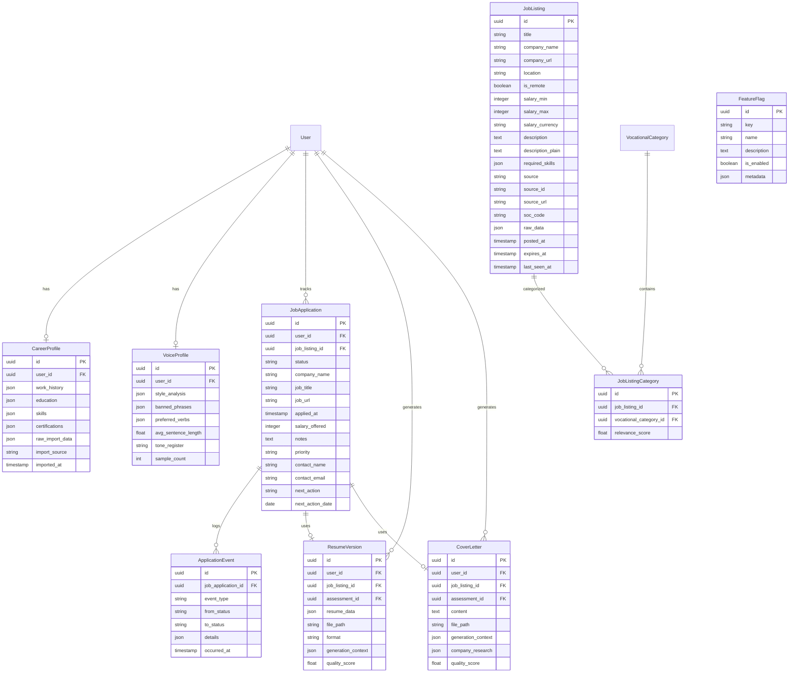

# ✨ feat: Vocational Operating System — Job Discovery, Resume AI & Application Tracking

> Transform Vocation Finder from a self-assessment tool into a **vocational operating system** where the assessment is the onboarding into a lifelong journey of integrated, secular-sacred vocational fulfillment.

---

## Overview

The assessment is the entryway. What follows is a complete career activation platform: real jobs mapped to vocational pathways, AI-powered resumes tailored per company, LinkedIn-informed career profiles, and full application tracking — all filtered through the theology of vocation and each person's unique internal makeup.

This plan adds five interconnected systems:

1. **Job Discovery Engine** — aggregate real jobs from APIs, classify them against the 17 vocational pathways, and score person-job fit
2. **Career Profile & LinkedIn Integration** — structured career data from LinkedIn PDFs or manual entry, refined through AI conversation
3. **AI Resume & Cover Letter Builder** — one-click generation per job+company, anti-AI-slop, voice-profiled, ATS-friendly
4. **Application Tracking** — full pipeline from saved → applied → interviewing → offered → outcome, with analytics
5. **Feature Flag System** — admin-toggleable gates for all new features, enabling internal testing before public release

All five systems feed into **dashboard analytics** at both the organization and platform admin level.

---

## Problem Statement

Users complete the assessment and receive a beautiful vocational profile with pathways and courses — but then hit a gap. The profile tells them *who they are* but not *where to go*. They leave the app to search job boards, write resumes from scratch, and track applications in spreadsheets. The vocational insight is disconnected from the job search reality.

Meanwhile, AI resume tools flood the market with generic, detectable "AI slop" that recruiters immediately discard. These tools don't understand the person — they just reformat keywords.

**We have a unique advantage**: deep personality and values data from the assessment. A resume generated with knowledge of someone's vocational calling, primary domain, and specific considerations will be fundamentally different from one generated by a generic tool. The theology of vocation — that every person has a calling that integrates sacred and secular purpose — gives us a narrative framework no competitor has.

---

## Technical Approach

### Architecture

All new features follow existing conventions:
- **Backend**: Laravel services + AI agents + queued jobs on Horizon
- **API**: Versioned under `/api/v1/`, Sanctum-authenticated
- **Web**: Inertia.js React pages within `AppLayout` (640px) and `AdminLayout` (6xl)
- **Mobile**: Expo screens consuming the same API, zustand stores with AsyncStorage
- **Data**: UUIDs on all models, soft deletes on user-facing entities
- **AI**: Laravel AI SDK agents with tools, dispatched to `ai-analysis` queue

```
┌─────────────────────────────────────────────────────────────────┐
│                    VOCATIONAL OPERATING SYSTEM                  │
├─────────────────────────────────────────────────────────────────┤
│                                                                 │
│  ┌──────────┐    ┌──────────────┐    ┌───────────────────────┐  │
│  │Assessment│───▶│  Vocational  │───▶│   Career Profile      │  │
│  │(existing)│    │   Profile    │    │ (LinkedIn + AI convo) │  │
│  └──────────┘    └──────────────┘    └───────────┬───────────┘  │
│                         │                        │              │
│                         ▼                        ▼              │
│              ┌──────────────────┐    ┌───────────────────────┐  │
│              │  Job Discovery   │    │  Resume & Cover       │  │
│              │  Engine          │◀──▶│  Letter Builder       │  │
│              │  (Adzuna/JSearch)│    │  (AI + Voice Profile) │  │
│              └────────┬─────────┘    └───────────┬───────────┘  │
│                       │                          │              │
│                       ▼                          ▼              │
│              ┌──────────────────────────────────────────────┐   │
│              │         Application Tracking                 │   │
│              │    saved → applied → interview → outcome     │   │
│              └──────────────────────────────────────────────┘   │
│                                                                 │
│  ┌──────────────────────────────────────────────────────────┐   │
│  │  Feature Flags  │  Dashboards  │  Analytics  │ Billing   │   │
│  └──────────────────────────────────────────────────────────┘   │
└─────────────────────────────────────────────────────────────────┘
```

### ERD — New Models



---

## Implementation Phases

### Phase 1: Foundation — Feature Flags & Career Profile (Weeks 1-2)

Everything else depends on these two systems. Feature flags gate all subsequent features. Career profile provides the structured data that resume generation needs.

#### 1A. Feature Flag System

**Why first**: Every subsequent feature must be gated. Building this first means everything else ships dark by default.

##### New Files

```
app/Models/FeatureFlag.php
app/Services/FeatureFlagService.php
app/Http/Middleware/CheckFeatureFlag.php
app/Http/Controllers/Api/V1/FeatureFlagController.php
app/Http/Controllers/Web/Admin/FeatureFlagController.php
database/migrations/xxxx_create_feature_flags_table.php
database/seeders/FeatureFlagSeeder.php
resources/js/Pages/Admin/FeatureFlags/Index.tsx
mobile/hooks/useFeatureFlags.ts
```

##### Data Model

```php
// database/migrations/xxxx_create_feature_flags_table.php
Schema::create('feature_flags', function (Blueprint $table) {
    $table->uuid('id')->primary();
    $table->string('key')->unique();           // e.g., 'job_discovery', 'resume_builder'
    $table->string('name');                      // Human-readable name
    $table->text('description')->nullable();
    $table->boolean('is_enabled')->default(false);
    $table->json('metadata')->nullable();        // Future: rollout %, user segments
    $table->timestamps();
});
```

##### Service Layer

```php
// app/Services/FeatureFlagService.php
class FeatureFlagService
{
    public function isEnabled(string $key): bool
    {
        return Cache::remember(
            "feature_flag:{$key}",
            now()->addMinutes(5),
            fn () => FeatureFlag::where('key', $key)->value('is_enabled') ?? false
        );
    }

    public function allFlags(): Collection
    {
        return Cache::remember(
            'feature_flags:all',
            now()->addMinutes(5),
            fn () => FeatureFlag::all()->pluck('is_enabled', 'key')
        );
    }

    public function toggle(string $key, bool $enabled): void
    {
        FeatureFlag::where('key', $key)->update(['is_enabled' => $enabled]);
        Cache::forget("feature_flag:{$key}");
        Cache::forget('feature_flags:all');
    }
}
```

##### API Endpoint (flags served to mobile + web)

```php
// GET /api/v1/features — public, cached, lightweight
// Returns: { "job_discovery": false, "resume_builder": false, ... }
```

##### Route Middleware

```php
// app/Http/Middleware/CheckFeatureFlag.php
// Usage: Route::middleware('feature:job_discovery')->group(...)
// Returns 404 if feature is disabled (invisible to users)
```

##### Admin UI

Simple toggle list on the admin dashboard at `/admin/feature-flags`. Each flag shows name, description, current state, and a toggle switch. Changes take effect within 5 minutes (cache TTL) or immediately if cache is busted on toggle.

##### Seeded Flags

| Key | Name | Default |
|-----|------|---------|
| `job_discovery` | Job Discovery | `false` |
| `career_profile` | Career Profile & LinkedIn Import | `false` |
| `resume_builder` | AI Resume Builder (includes conversational coach) | `false` |
| `cover_letter_builder` | AI Cover Letter Builder | `false` |
| `application_tracking` | Application Tracking | `false` |
| `voice_profile` | Voice Profile | `false` |
| `job_alerts` | Job Alert Notifications | `false` |
| `career_coach` | AI Career Coaching Conversation | `false` |

- [x] Create `FeatureFlag` model with UUID
- [x] Create `FeatureFlagService` with cache-backed lookups
- [x] Create `CheckFeatureFlag` middleware
- [x] Create API endpoint `GET /api/v1/features`
- [x] Create admin web controller + Inertia page for toggle UI
- [x] Create mobile `useFeatureFlags` hook (fetches on app load, caches locally)
- [x] Seed all flags as `false` by default
- [x] Share feature flags via `HandleInertiaRequests` middleware for web
- [x] Add feature flag state to the `GET /api/v1/auth/me` response for mobile

#### 1B. Career Profile & LinkedIn Import

##### New Files

```
app/Models/CareerProfile.php
app/Services/ResumeParserService.php
app/Http/Controllers/Api/V1/CareerProfileController.php
app/Jobs/ParseResumeUploadJob.php
database/migrations/xxxx_create_career_profiles_table.php
resources/js/Pages/CareerProfile/Index.tsx
resources/js/Pages/CareerProfile/Import.tsx
mobile/app/(tabs)/career-profile.tsx
mobile/app/(career)/import.tsx
mobile/app/(career)/edit.tsx
mobile/stores/careerProfileStore.ts
```

##### Data Model

```php
// career_profiles table
Schema::create('career_profiles', function (Blueprint $table) {
    $table->uuid('id')->primary();
    $table->foreignUuid('user_id')->constrained()->cascadeOnDelete();
    $table->json('work_history')->nullable();       // JSON Resume 'work' section
    $table->json('education')->nullable();           // JSON Resume 'education' section
    $table->json('skills')->nullable();              // JSON Resume 'skills' section
    $table->json('certifications')->nullable();      // JSON Resume 'certificates' section
    $table->json('volunteer')->nullable();           // JSON Resume 'volunteer' section
    $table->json('raw_import_data')->nullable();     // Original parsed data before normalization
    $table->string('import_source')->nullable();     // 'linkedin_pdf', 'resume_pdf', 'manual'
    $table->timestamp('imported_at')->nullable();
    $table->timestamps();
    $table->softDeletes();
});
```

##### Import Flow

1. User uploads a PDF (LinkedIn export or general resume)
2. `ParseResumeUploadJob` dispatched to queue
3. Job uses `ResumeParserService` to extract structured data (using `sharpapi/laravel-resume-parser` for AI-powered parsing or `akhileshdarjee/linkedin-resume-parser` for LinkedIn-specific)
4. Parsed data normalized to JSON Resume schema
5. Stored as `CareerProfile` linked to user
6. User can review and edit in-app

##### Manual Entry

Guided multi-step form (work history → education → skills → certifications) with smart defaults based on vocational assessment. For example, someone with a "Healing & Care" pathway sees healthcare-specific skill suggestions.

##### API Endpoints

```
POST   /api/v1/career-profile/import   — Upload PDF for parsing
GET    /api/v1/career-profile          — Get structured career profile
PUT    /api/v1/career-profile          — Update career profile
DELETE /api/v1/career-profile          — Remove career profile
```

All gated behind `feature:career_profile` middleware.

- [x] Create `CareerProfile` model with JSON Resume schema structure
- [ ] Create `ResumeParserService` (evaluate `sharpapi/laravel-resume-parser` vs custom AI parsing)
- [ ] Create `ParseResumeUploadJob` for background PDF processing
- [x] Build API CRUD endpoints gated behind feature flag
- [x] Build web import + edit pages
- [x] Build mobile career profile screen (view mode, conditional tab)
- [x] Store uploaded PDFs on S3 (private bucket, temporary URLs for re-download)

---

### Phase 2: Job Discovery Engine (Weeks 3-5)

The core of the vocational operating system — connecting vocational pathways to real, available jobs.

#### 2A. Job Ingestion Pipeline

##### New Files

```
app/Models/JobListing.php
app/Models/JobListingCategory.php
app/Models/JobSource.php
app/Services/Jobs/JobIngestionService.php
app/Services/Jobs/Adapters/AdzunaAdapter.php
app/Services/Jobs/Adapters/JSearchAdapter.php
app/Services/Jobs/Adapters/TheMuseAdapter.php
app/Services/Jobs/JobNormalizerService.php
app/Services/Jobs/JobDeduplicationService.php
app/Services/Jobs/JobClassificationService.php
app/Services/Jobs/JobMatchingService.php
app/Jobs/IngestJobListingsJob.php
app/Jobs/ClassifyJobListingJob.php
app/Jobs/ExpireStaleJobListingsJob.php
app/AI/Agents/JobClassifierAgent.php
app/AI/Tools/OnetLookupTool.php
app/Console/Commands/IngestJobsCommand.php
database/migrations/xxxx_create_job_listings_table.php
database/migrations/xxxx_create_job_listing_categories_table.php
database/migrations/xxxx_create_soc_vocational_mappings_table.php
database/seeders/SocVocationalMappingSeeder.php
config/jobs.php
```

##### Pipeline Architecture

```
┌─────────────┐     ┌──────────────┐     ┌──────────────┐     ┌───────────┐
│  Scheduled   │────▶│   Adapter    │────▶│  Normalizer  │────▶│  Dedup    │
│  Artisan Cmd │     │ (per source) │     │  (unified    │     │  Service  │
│  (hourly)    │     │              │     │   schema)    │     │           │
└─────────────┘     └──────────────┘     └──────────────┘     └─────┬─────┘
                                                                    │
                                                          ┌─────────▼─────────┐
                                                          │   AI Classifier   │
                                                          │  (SOC → Vocation) │
                                                          │   (batched jobs)  │
                                                          └─────────┬─────────┘
                                                                    │
                                                          ┌─────────▼─────────┐
                                                          │     Store in DB   │
                                                          │  + category links │
                                                          └───────────────────┘
```

##### Source Adapters

Each adapter implements a common interface:

```php
interface JobSourceAdapter
{
    public function fetch(array $params): Collection;  // Returns normalized JobListing DTOs
    public function sourceKey(): string;               // e.g., 'adzuna', 'jsearch'
}
```

**Adzuna** (primary — free tier, 12+ countries):
- Endpoint: `https://api.adzuna.com/v1/api/jobs/{country}/search/{page}`
- Search by keyword, location, category, salary range
- Rate limit: generous on registered apps
- Provides salary estimates and company data

**JSearch via RapidAPI** (secondary — aggregates Google for Jobs):
- Pulls from LinkedIn, Indeed, Glassdoor, ZipRecruiter via Google for Jobs
- 40+ data points per listing
- Tiered pricing on RapidAPI

**The Muse** (tertiary — company culture enrichment):
- Free API with company profiles + job listings
- Good for company research data that feeds into cover letter personalization

##### SOC-to-Vocational-Category Mapping

Pre-seeded mapping table bridging O*NET SOC codes to the 17 vocational categories:

```php
// database/migrations/xxxx_create_soc_vocational_mappings_table.php
Schema::create('soc_vocational_mappings', function (Blueprint $table) {
    $table->uuid('id')->primary();
    $table->string('soc_major_group');              // e.g., '29-0000'
    $table->string('soc_group_name');               // e.g., 'Healthcare Practitioners'
    $table->foreignUuid('vocational_category_id')->constrained();
    $table->float('default_relevance')->default(0.8);
    $table->timestamps();
});
```

Key mappings (many-to-many — a job can map to multiple categories):

| SOC Major Group | Vocational Category | Relevance |
|----------------|---------------------|-----------|
| 29-0000 Healthcare Practitioners | Healing & Care | 0.95 |
| 25-0000 Postsecondary Teachers | Teaching & Formation | 0.90 |
| 11-0000 Management | Leadership & Management | 0.85 |
| 23-0000 Legal | Law & Policy | 0.90 |
| 33-0000 Protective Service | Protecting & Defending | 0.90 |
| 47-0000 Construction | Creating & Building | 0.85 |
| 49-0000 Installation/Maintenance | Maintaining & Repairing | 0.85 |
| 27-0000 Arts/Design/Media | Arts & Beauty | 0.85 |
| 19-0000 Life/Physical/Social Science | Discovering & Innovating | 0.90 |
| 35-0000 Food Preparation | Nourishing & Hospitality | 0.85 |
| 41-0000 Sales | Commerce & Enterprise | 0.80 |
| 13-0000 Business/Financial | Finance & Economics | 0.85 |
| 27-3000 Media/Communication | Communication & Media | 0.85 |
| 21-0000 Community/Social Service | Advocating & Supporting | 0.90 |
| 25-4000 Librarians/Archivists | Knowledge & Information | 0.85 |
| 15-0000 Computer/Mathematical | Administration & Systems | 0.80 |

`Pastoral & Missionary Work` has no direct SOC mapping — classified by AI agent based on job description keywords (ministry, church, missions, chaplain, etc.).

##### AI Classification Agent

```php
// app/AI/Agents/JobClassifierAgent.php
// Uses Laravel AI SDK with O*NET lookup tool
// Input: job title + description
// Output: SOC code + vocational category IDs with relevance scores
// Dispatched as batched jobs on 'ai-analysis' queue
```

##### Job Matching Score

Three-factor scoring for person-job fit:

```
Final Score = (0.5 × vocational_alignment) + (0.3 × skills_match) + (0.2 × values_alignment)
```

- **Vocational alignment (0-1)**: Cosine similarity between job's category weight vector and user's `category_scores` from VocationalProfile
- **Skills match (0-1)**: Overlap between job's `required_skills` and user's CareerProfile `skills`
- **Values alignment (0-1)**: O*NET work values mapped to assessment question category scores

##### Job Ingestion Cost Analysis

| API | Free Tier | Recommended Paid Tier | Monthly Cost | Requests/Month | Rate Limit |
|-----|-----------|----------------------|--------------|----------------|------------|
| **Adzuna** | Free (generous limits) | Custom (contact them) | $0 to start | Not published; generous | Not published |
| **JSearch (RapidAPI)** | 200 req/mo | Pro ($25/mo) or Ultra ($75/mo) | $25-75 | 10,000-50,000 | 5-10 req/sec |
| **The Muse** | Free (unlimited) | N/A — free | $0 | Unlimited | 3,600 req/hr (registered) |
| **O*NET** | Free (govt-funded) | N/A — free | $0 | Unlimited | Best-effort (no strict limit) |

**Projected Monthly Costs by Scale:**

| Scale | Adzuna | JSearch | The Muse | O*NET | AI Classification | **Total** |
|-------|--------|---------|----------|-------|-------------------|-----------|
| **MVP (1k listings/day)** | $0 | $25 (Pro) | $0 | $0 | ~$15 (Haiku) | **~$40/mo** |
| **Growth (5k listings/day)** | $0 | $75 (Ultra) | $0 | $0 | ~$60 (Haiku) | **~$135/mo** |
| **Scale (20k listings/day)** | Custom | $150 (Mega) | $0 | $0 | ~$200 (Haiku) | **~$350+/mo** |

**AI Classification Cost Breakdown:**
- Using Claude Haiku for SOC code classification: ~$0.01-0.02 per listing (input: job title + description excerpt, output: SOC code + category IDs)
- At 1,000 new listings/day = ~$10-20/month for classification alone
- Deduplication reduces AI calls — only new/unique listings need classification

**Cost Optimization Strategies:**
- Cache O*NET SOC data locally (updates quarterly) — eliminates ongoing API calls
- Batch JSearch queries by pathway keyword (1 query returns 10+ results vs. 1 query per listing)
- Use Adzuna's category filtering to pre-filter by vocational-relevant categories before ingesting
- Deduplicate before AI classification to avoid paying for duplicate analysis
- Start with Adzuna (free) + The Muse (free) for MVP; add JSearch only when coverage gaps emerge

##### Scheduled Ingestion

```php
// routes/console.php
Schedule::command('jobs:ingest --source=adzuna')->hourly();
Schedule::command('jobs:ingest --source=jsearch')->everyTwoHours();
Schedule::command('jobs:ingest --source=muse')->everyFourHours();
Schedule::command('jobs:expire-stale')->daily();
```

- [x] Create `JobListing` model with full schema (title, company, location, salary, source, SOC code, etc.)
- [x] Create `JobListingCategory` pivot model (many-to-many with VocationalCategory + relevance score)
- [x] Build `AdzunaAdapter` with rate limiting and pagination
- [ ] Build `JSearchAdapter` with RapidAPI auth and rate limiting
- [x] Build `TheMuseAdapter` for company data enrichment
- [ ] Create `JobNormalizerService` to unify data across sources
- [x] Create `JobDeduplicationService` (fuzzy match on company + title + location)
- [x] Create `JobClassifierAgent` AI agent with O*NET lookup tool
- [x] Seed `soc_vocational_mappings` table with all major group mappings
- [x] Create `JobMatchingService` with three-factor scoring algorithm
- [x] Create scheduled artisan commands for ingestion + stale expiry
- [ ] Configure Horizon queue for `job-pipeline` worker
- [x] Store API keys in `config/jobs.php` (Adzuna app_id/key, RapidAPI key)

#### 2B. Job Discovery UI

##### New Files

```
app/Http/Controllers/Api/V1/JobListingController.php
resources/js/Pages/Jobs/Index.tsx
resources/js/Pages/Jobs/Show.tsx
mobile/app/(tabs)/jobs.tsx
mobile/app/(jobs)/[id].tsx
mobile/app/(jobs)/search.tsx
mobile/stores/jobStore.ts
```

##### API Endpoints

```
GET  /api/v1/jobs                — List jobs (filterable, sortable, paginated)
GET  /api/v1/jobs/:id            — Job detail with match score for authenticated user
GET  /api/v1/jobs/recommended    — Top matches for user's vocational profile
POST /api/v1/jobs/:id/save       — Save/bookmark a job
DELETE /api/v1/jobs/:id/save     — Remove bookmark
```

Query params for listing: `?pathway=healing-care&location=remote&salary_min=50000&sort=match_score&page=1`

All gated behind `feature:job_discovery` middleware.

##### Mobile UX

- **Jobs tab** in bottom navigation (conditionally shown based on feature flag)
- **Recommended feed** as default view — jobs ranked by match score with vocational alignment indicator
- **Search** with filters: pathway, location, remote, salary range
- **Job card** shows: title, company, location, salary range, match score badge (e.g., "92% match"), top vocational category tag
- **Job detail** shows: full description, match breakdown (vocational/skills/values), one-tap "Save" and "Apply" actions, company info
- **Empty state**: "Complete your assessment to see personalized job matches" (if no VocationalProfile)

- [x] Create `JobListingController` with filtering, pagination, match scoring
- [x] Build web browse/search page with filters
- [x] Build web job detail page with match breakdown
- [x] Build mobile jobs tab with recommended feed
- [ ] Build mobile job detail screen (navigate from card to detail)
- [ ] Build mobile search with filters (search bar + filter sheet)
- [x] Implement save/bookmark functionality
- [x] Handle empty states (no assessment, no matches, no results)

---

### Phase 3: AI Resume & Cover Letter Builder (Weeks 6-9)

The highest-value feature — generating personalized career documents that leverage the vocational assessment in a way no generic tool can.

#### 3A. Voice Profile System

##### New Files

```
app/Models/VoiceProfile.php
app/Services/VoiceProfileService.php
app/AI/Agents/VoiceAnalyzerAgent.php
app/Http/Controllers/Api/V1/VoiceProfileController.php
database/migrations/xxxx_create_voice_profiles_table.php
```

##### How It Works

1. User provides 4-6 writing samples (past cover letters, LinkedIn posts, emails, bio text)
2. `VoiceAnalyzerAgent` analyzes samples to extract:
   - Average sentence length and variance
   - Vocabulary complexity (Flesch-Kincaid level)
   - Preferred action verbs (top 20)
   - Tone register (formal / conversational / academic)
   - Characteristic phrases and patterns
   - Banned phrases to avoid (identified AI-sounding patterns)
3. Profile stored as JSON on `VoiceProfile` model
4. Used as a rewrite filter in the two-pass resume/cover letter generation

##### API Endpoints

```
POST /api/v1/voice-profile/samples  — Submit writing samples for analysis
GET  /api/v1/voice-profile          — Get current voice profile
PUT  /api/v1/voice-profile          — Update/recalibrate
```

Gated behind `feature:voice_profile`.

- [x] Create `VoiceProfile` model
- [x] Create `VoiceAnalyzerAgent` using Laravel AI SDK
- [ ] Build sample submission UI (web + mobile)
- [ ] Implement voice profile display (shows detected style characteristics)

#### 3B. Resume Builder

##### New Files

```
app/Models/ResumeVersion.php
app/Services/ResumeGenerationService.php
app/AI/Agents/ResumeWriterAgent.php
app/AI/Agents/ResumeQualityAgent.php
app/AI/Tools/CompanyResearchTool.php
app/Jobs/GenerateResumeJob.php
app/Http/Controllers/Api/V1/ResumeController.php
database/migrations/xxxx_create_resume_versions_table.php
resources/js/Pages/Resumes/Index.tsx
resources/js/Pages/Resumes/Show.tsx
mobile/app/(career)/resumes.tsx
mobile/app/(career)/resume/[id].tsx
```

##### Generation Pipeline

```
[Job Listing] + [Career Profile] + [Vocational Profile] + [Voice Profile]
    │
    ▼
[Pass 1: ResumeWriterAgent]
    - Selects relevant experience from CareerProfile
    - Reorders and emphasizes based on VocationalProfile alignment
    - Tailors language to job description keywords (ATS optimization)
    - Researches company via CompanyResearchTool
    - Outputs JSON Resume format
    │
    ▼
[Pass 2: Voice Profile Rewrite]
    - Rewrites through user's voice profile
    - Applies banned phrase list
    - Varies sentence structure
    - Targets voice register
    │
    ▼
[Pass 3: ResumeQualityAgent]
    - Scores on: specificity, authenticity, ATS-friendliness, vocational alignment
    - Flags any remaining AI-sounding phrases
    - Returns quality score (0-100)
    │
    ▼
[Render to DOCX + PDF]
    - ATS-friendly single-column layout
    - Standard fonts (Calibri, Garamond)
    - No tables, graphics, or headers/footers
    - Stored on S3 with temporary download URLs
```

##### Anti-AI-Slop Measures

Built into the system prompt and quality scoring:

1. **Banned phrase list**: "leverage," "synergy," "fast-paced environment," "proven track record," "results-driven," "passionate about," "I'm excited to apply"
2. **Structural variation**: No more than 2 consecutive bullets can follow the same grammatical pattern
3. **Specificity requirement**: Every bullet must include at least one concrete detail (number, name, tool, date)
4. **Voice profile filter**: Two-pass generation ensures output matches the user's actual writing style
5. **Quality gate**: `ResumeQualityAgent` scores below 70 trigger automatic regeneration with adjusted parameters
6. **Reading level target**: 9th-grade Flesch-Kincaid unless user's voice profile indicates otherwise

##### Data Model

```php
// resume_versions table
Schema::create('resume_versions', function (Blueprint $table) {
    $table->uuid('id')->primary();
    $table->foreignUuid('user_id')->constrained()->cascadeOnDelete();
    $table->foreignUuid('job_listing_id')->nullable()->constrained()->nullOnDelete();
    $table->foreignUuid('assessment_id')->nullable()->constrained()->nullOnDelete();
    $table->json('resume_data');                    // JSON Resume format — canonical source
    $table->string('file_path_pdf')->nullable();    // S3 path
    $table->string('file_path_docx')->nullable();   // S3 path
    $table->json('generation_context')->nullable();  // What inputs were used
    $table->float('quality_score')->nullable();      // 0-100 from ResumeQualityAgent
    $table->string('status')->default('generating'); // generating, ready, failed
    $table->timestamps();
    $table->softDeletes();
});
```

##### API Endpoints

```
POST /api/v1/resumes/generate         — Generate resume for a specific job
GET  /api/v1/resumes                  — List user's resume versions
GET  /api/v1/resumes/:id              — Get resume detail + download URLs
GET  /api/v1/resumes/:id/download     — Get temporary download URL (PDF or DOCX)
DELETE /api/v1/resumes/:id            — Soft-delete a resume version
```

Gated behind `feature:resume_builder`.

- [x] Create `ResumeVersion` model
- [x] Create `ResumeWriterAgent` with anti-slop system prompt
- [x] Create `ResumeQualityAgent` for scoring and AI-slop detection
- [ ] Create `CompanyResearchTool` (fetches company info from The Muse API + web)
- [x] Implement two-pass generation with voice profile rewrite (in GenerateResumeJob)
- [x] Implement quality gate (auto-regenerate below score threshold)
- [ ] Generate DOCX using PHPWord (ATS-friendly format) — needs `composer require phpoffice/phpword`
- [x] Generate PDF using DomPDF (Blade template at resumes/pdf.blade.php)
- [x] Store generated files on S3 with temporary URL access
- [x] Build web resume list + detail pages
- [ ] Build mobile resume list + detail screens
- [ ] Track resume generation usage for billing (metered event)

#### 3C. Cover Letter Builder

##### New Files

```
app/Models/CoverLetter.php
app/AI/Agents/CoverLetterWriterAgent.php
app/Jobs/GenerateCoverLetterJob.php
app/Http/Controllers/Api/V1/CoverLetterController.php
database/migrations/xxxx_create_cover_letters_table.php
```

##### 3-Touch Personalization Method

Each cover letter includes three distinct personalization layers:

1. **Company research touch**: References the company's mission, recent news, or specific initiatives (data from `CompanyResearchTool`)
2. **Role alignment touch**: Maps specific user experiences to specific job requirements using CareerProfile + job description
3. **Personal story touch**: Connects the user's vocational calling to the role — "My calling to [primary pathway] draws me to this work because..." using VocationalProfile data and `ministry_integration` context

##### API Endpoints

```
POST /api/v1/cover-letters/generate   — Generate cover letter for a specific job
GET  /api/v1/cover-letters            — List user's cover letters
GET  /api/v1/cover-letters/:id        — Get cover letter detail
GET  /api/v1/cover-letters/:id/download — Temporary download URL
DELETE /api/v1/cover-letters/:id      — Soft-delete
```

Gated behind `feature:cover_letter_builder`.

- [x] Create `CoverLetter` model
- [x] Create `CoverLetterWriterAgent` with 3-touch method
- [x] Apply same anti-AI-slop pipeline (voice profile rewrite in GenerateCoverLetterJob)
- [x] Generate as PDF (Blade template at cover-letters/pdf.blade.php)
- [x] Build web cover letter list view
- [ ] Track generation usage for billing

#### 3D. Conversational Resume Builder Agent (First-Time Resume Creation)

Many users — especially middle schoolers, high schoolers, and early college students — have **never written a resume**. The one-click generation in 3B assumes a populated `CareerProfile`. This agent fills the gap: a guided, conversational experience that builds a resume from scratch, pulling from the assessment and asking the right questions for the user's life stage.

##### The Problem

A 14-year-old and a 30-year-old with 10 years of experience need fundamentally different resume-building experiences. A generic form with "Work History" fields is intimidating and irrelevant for someone who hasn't had a formal job. But that same student has volunteer work, school projects, extracurriculars, church involvement, and emerging skills that a vocation-aware agent can surface and frame professionally.

##### New Files

```
app/AI/Agents/ResumeCoachAgent.php
app/AI/Tools/GetAssessmentAnswersTool.php
app/AI/Tools/GetCareerProfileTool.php
app/AI/Tools/SaveCareerProfileTool.php
app/AI/Tools/GenerateResumeTool.php
app/Http/Controllers/Api/V1/ResumeConversationController.php
resources/js/Pages/Resumes/Conversation.tsx
mobile/app/(career)/resume-conversation.tsx
```

##### How It Works

The `ResumeCoachAgent` uses the Laravel AI SDK's `RemembersConversations` trait (multi-turn dialogue) and `HasTools` (access to user data + resume generation).

**Conversation Flow:**

```
┌─────────────────────────────────────────────────────────────────┐
│                    RESUME COACH CONVERSATION                    │
├─────────────────────────────────────────────────────────────────┤
│                                                                 │
│  1. LIFE STAGE DETECTION                                        │
│     "Tell me a bit about where you are right now —              │
│      are you in school, working, or somewhere in between?"      │
│     → Agent detects: middle school / high school / college /    │
│       early career / experienced professional                   │
│                                                                 │
│  2. ASSESSMENT-INFORMED QUESTIONS                               │
│     Agent reads VocationalProfile via GetAssessmentAnswersTool  │
│     "Your assessment shows a strong calling toward [Healing &   │
│      Care]. Have you done any volunteering, caregiving, or      │
│      projects related to helping people?"                       │
│                                                                 │
│  3. EXPERIENCE MINING (stage-appropriate)                       │
│     Middle/High School:                                         │
│       - School clubs, teams, organizations                      │
│       - Volunteer work, church activities                       │
│       - Part-time or informal jobs (babysitting, lawn care)     │
│       - Class projects with real-world impact                   │
│       - Awards, honors, certifications                          │
│     College:                                                    │
│       - Internships, co-ops, research                           │
│       - Campus leadership, organizations                        │
│       - Relevant coursework, capstone projects                  │
│       - Part-time and summer employment                         │
│     Experienced:                                                │
│       - Full work history (guided, not form-based)              │
│       - Key achievements and impact stories                     │
│       - Skills and tools used daily                             │
│                                                                 │
│  4. SKILLS EXTRACTION                                           │
│     Agent identifies transferable skills from stories           │
│     "It sounds like organizing that fundraiser involved         │
│      project management, budgeting, and team coordination.      │
│      Those are real professional skills."                        │
│                                                                 │
│  5. PROFILE BUILDING                                            │
│     Agent saves structured data via SaveCareerProfileTool       │
│     Builds CareerProfile in JSON Resume format                  │
│                                                                 │
│  6. RESUME GENERATION                                           │
│     Agent generates resume via GenerateResumeTool               │
│     Appropriate format for life stage:                          │
│       - Students: skills-focused, education-first layout        │
│       - Early career: hybrid (skills + experience)              │
│       - Experienced: experience-first chronological             │
│                                                                 │
│  7. REVIEW & REFINEMENT                                         │
│     "Here's your resume. A few things I'd suggest we adjust..." │
│     Multi-turn refinement until user is satisfied               │
│                                                                 │
└─────────────────────────────────────────────────────────────────┘
```

##### Agent Design

```php
// app/AI/Agents/ResumeCoachAgent.php
// Uses: RemembersConversations (multi-turn), HasTools
// System prompt emphasizes:
//   - Warm, encouraging tone (especially for young users)
//   - Never condescending — treat a middle schooler's volunteer work
//     with the same respect as a professional's 10-year career
//   - Frame everything through vocational calling
//   - Extract transferable skills from non-traditional experience
//   - Adapt resume format to life stage
//   - Use the theology of vocation: every person's work has dignity
//     and purpose, whether it's babysitting or managing a team
```

##### Tools Available to the Agent

| Tool | Purpose |
|------|---------|
| `GetAssessmentAnswersTool` | Read the user's assessment answers and VocationalProfile to inform questions |
| `GetCareerProfileTool` | Check if user already has career profile data (may be empty for first-timers) |
| `SaveCareerProfileTool` | Persist structured career data as the conversation progresses |
| `GenerateResumeTool` | Trigger resume generation once enough data is collected |

##### Life-Stage-Appropriate Resume Formats

| Life Stage | Resume Style | Key Sections |
|------------|-------------|--------------|
| **Middle School** | Activities & Skills Focus | Objective, Skills, Activities & Volunteering, Education, Awards |
| **High School** | Hybrid Skills-First | Objective, Skills, Experience (incl. informal), Activities, Education, Awards |
| **College** | Education + Experience | Summary, Education, Relevant Experience, Skills, Activities, Projects |
| **Early Career (0-3 yrs)** | Hybrid | Summary, Skills, Experience, Education, Certifications |
| **Experienced (3+ yrs)** | Chronological | Professional Summary, Experience, Skills, Education |

##### API Endpoints

```
POST /api/v1/resume-conversation/start     — Start new resume coaching conversation
POST /api/v1/resume-conversation/message   — Send message in conversation
GET  /api/v1/resume-conversation/history   — Get conversation history
```

Gated behind `feature:resume_builder` (same flag as one-click generation).

##### Integration with One-Click Generation (3B)

The conversational agent **populates the CareerProfile** — once the user has gone through the conversation, their profile is filled and the one-click generation (3B) works for future job applications. The conversation is the onboarding into the resume system, just as the assessment is the onboarding into the platform.

```
First-time user (no career data):
  → Conversational Resume Coach (3D) → builds CareerProfile → generates first resume
  → Future jobs: one-click generation (3B) using populated CareerProfile

Experienced user (has career data):
  → One-click generation (3B) directly
  → Can still use conversation (3D) to refine or rebuild
```

- [x] Create `ResumeCoachAgent` with `RemembersConversations` + `HasTools`
- [x] Create `GetAssessmentAnswersTool` for reading vocational profile in conversation
- [x] Create `SaveCareerProfileTool` for persisting data from conversation
- [ ] Create `GenerateResumeTool` for triggering resume creation from conversation
- [x] Implement life-stage detection logic (in GenerateResumeJob)
- [ ] Build stage-appropriate resume templates (5 formats from middle school to experienced)
- [ ] Build web conversation UI (similar to existing assessment conversation)
- [ ] Build mobile conversation screen
- [x] Handle edge cases: progressive saving via SaveCareerProfileTool preserves progress
- [x] Warm, encouraging system prompt that treats all experience levels with dignity

---

### Phase 4: Application Tracking (Weeks 10-12)

Close the loop — users track their entire job search journey within the app.

#### 4A. Application Tracking Core

##### New Files

```
app/Models/JobApplication.php
app/Models/ApplicationEvent.php
app/Services/ApplicationTrackingService.php
app/Http/Controllers/Api/V1/JobApplicationController.php
app/Jobs/DetectGhostedApplicationsJob.php
app/Notifications/FollowUpReminderNotification.php
database/migrations/xxxx_create_job_applications_table.php
database/migrations/xxxx_create_application_events_table.php
resources/js/Pages/Applications/Index.tsx
resources/js/Pages/Applications/Show.tsx
mobile/app/(tabs)/applications.tsx
mobile/app/(applications)/[id].tsx
mobile/stores/applicationStore.ts
```

##### Status Workflow

```
saved ──▶ applied ──▶ phone_screen ──▶ interviewing ──▶ offered ──▶ accepted
                                                              └──▶ declined
                  └──▶ rejected
                  └──▶ withdrawn
                  └──▶ ghosted (auto-detected after 14 days)
```

##### API Endpoints

```
POST   /api/v1/applications                — Create (from job listing or manual entry)
GET    /api/v1/applications                — List with filters (status, date range)
GET    /api/v1/applications/:id            — Detail with event timeline
PUT    /api/v1/applications/:id            — Update status, notes, next action
DELETE /api/v1/applications/:id            — Soft-delete
POST   /api/v1/applications/:id/events     — Log an event
GET    /api/v1/applications/analytics      — Funnel metrics for the user
```

Gated behind `feature:application_tracking`.

##### Quick-Add from Job Discovery

When viewing a job listing, "Save" button creates a `JobApplication` in `saved` status. "Apply" button transitions to `applied` and opens the job's external URL. Resume/cover letter generation is accessible from the application detail view.

##### Auto-Ghosting Detection

```php
// Scheduled daily
// DetectGhostedApplicationsJob
// Finds applications in 'applied' status with no events for 14+ days
// Transitions to 'ghosted' status, logs ApplicationEvent
```

##### Follow-Up Reminders

Push notifications (Expo) and email reminders when:
- 7 days after applying with no status change: "Consider following up on your application to [Company]"
- `next_action_date` is today: "Reminder: [next_action] for [Company]"

- [ ] Create `JobApplication` model with status enum
- [ ] Create `ApplicationEvent` model for activity log
- [ ] Create `ApplicationTrackingService` with status transition validation
- [ ] Build API CRUD + analytics endpoint
- [ ] Build web kanban board view (drag-and-drop status changes)
- [ ] Build web list view as alternative
- [ ] Build mobile applications tab with status-grouped list
- [ ] Build mobile application detail with event timeline
- [ ] Implement quick-add from job listings
- [ ] Create `DetectGhostedApplicationsJob` scheduled daily
- [ ] Create follow-up reminder notifications (push + email)
- [ ] Install `expo-notifications` for mobile push support

#### 4B. Application Analytics

Available at `GET /api/v1/applications/analytics`:

```json
{
  "funnel": {
    "saved": 45,
    "applied": 28,
    "phone_screen": 12,
    "interviewing": 8,
    "offered": 3,
    "accepted": 2
  },
  "conversion_rates": {
    "saved_to_applied": 0.62,
    "applied_to_interview": 0.43,
    "interview_to_offer": 0.375,
    "offer_to_accepted": 0.67
  },
  "avg_response_days": 4.2,
  "ghosted_rate": 0.18,
  "avg_days_in_stage": {
    "applied": 5.3,
    "interviewing": 11.2,
    "offered": 3.1
  },
  "source_effectiveness": {
    "adzuna": { "applied": 15, "interviewed": 6, "callback_rate": 0.40 },
    "jsearch": { "applied": 10, "interviewed": 3, "callback_rate": 0.30 }
  },
  "vocational_alignment_correlation": {
    "high_match_callback_rate": 0.52,
    "low_match_callback_rate": 0.18
  },
  "weekly_velocity": 4.5
}
```

The `vocational_alignment_correlation` metric is unique to this platform — it validates whether higher vocational match scores actually lead to better job search outcomes. This is a powerful data point for proving the assessment's value.

- [ ] Build analytics aggregation queries
- [ ] Expose via API for mobile and web
- [ ] Display on user dashboard
- [ ] Feed into organization and platform admin dashboards

---

### Phase 5: Dashboard Analytics & AI Career Coaching (Weeks 13-16)

#### 5A. Organization Dashboard Extensions

Extend the existing org admin dashboard (`app/Http/Controllers/Web/Admin/`) with new panels:

##### New Metrics for Org Admins

| Metric | Description |
|--------|-------------|
| Member Job Search Activity | How many org members are actively using job discovery |
| Application Volume | Applications submitted by members, trend over time |
| Interview Rate | % of applications reaching interview stage |
| Placement Rate | % of members who accepted a job offer |
| Avg Time to Placement | Days from first application to accepted offer |
| Top Pathways Pursued | Which vocational categories members are applying to |
| Resume Generation Usage | How many resumes generated, quality scores |

##### API Endpoints (org-scoped)

```
GET /api/v1/organizations/:id/job-analytics    — Aggregate job search metrics
GET /api/v1/organizations/:id/placements       — Placement tracking
```

- [ ] Extend existing `OrganizationDashboardController` with job analytics
- [ ] Build org-level aggregate queries (scoped to org members)
- [ ] Add web dashboard panels for job search metrics
- [ ] Add mobile org dashboard sections

#### 5B. Platform Admin Dashboard Extensions

Extend the existing platform admin dashboard with system-wide job platform metrics:

##### New Metrics for Platform Admins

| Metric | Description |
|--------|-------------|
| Total Jobs Ingested | Count by source, freshness, category |
| Job Discovery Usage | DAU/MAU on job features, search queries |
| Resume Generation Volume | Total generated, avg quality score, regeneration rate |
| Application Funnel (platform-wide) | Aggregate conversion rates across all users |
| Feature Flag Status | Current state of all flags |
| API Usage | Calls to external job APIs, cost tracking |
| Vocational Alignment Validation | Does higher match score → better outcomes? (platform-wide) |

- [ ] Extend `PlatformAnalyticsService` with job platform metrics
- [ ] Add `DashboardSnapshot` metric keys for new KPIs
- [ ] Build admin web dashboard panels
- [ ] Track external API costs and usage

#### 5C. AI Career Coaching Conversation

An evolution of the existing conversation system — after assessment completion and career profile setup, users can have an ongoing AI conversation that:

1. Reviews their vocational profile + career history together
2. Helps narrow down specific job types within their pathways
3. Suggests which jobs from the discovery feed best align with their full picture
4. Helps refine their career narrative before resume generation

##### New Files

```
app/AI/Agents/CareerCoachAgent.php
app/AI/Tools/SearchJobsTool.php
app/AI/Tools/GetVocationalProfileTool.php
app/AI/Tools/GetCareerProfileTool.php
```

This agent uses the Laravel AI SDK's `RemembersConversations` trait for multi-turn dialogue, and `HasTools` for accessing the user's profile data and job listings.

- [ ] Create `CareerCoachAgent` with conversation memory
- [ ] Create tools: `SearchJobsTool`, `GetVocationalProfileTool`, `GetCareerProfileTool`
- [ ] Build web conversation UI (extend existing conversation patterns)
- [ ] Build mobile conversation screen
- [ ] Gate behind feature flag

---

## Alternative Approaches Considered

### Job Data: Build-Your-Own Scraper vs. API Aggregation
**Rejected**: Building a custom scraper carries legal risk (hiQ v. LinkedIn precedent), maintenance burden, and fragility. APIs (Adzuna, JSearch) provide normalized data with legal clarity. DaaS providers (JobsPikr, Mantiks) are a fallback if API coverage is insufficient.

### Resume Format: LaTeX vs. PHPWord/DomPDF
**Rejected**: LaTeX produces beautiful documents but requires a TeX installation on the server, adds deployment complexity, and is harder to template dynamically. PHPWord + DomPDF align with the existing stack (DomPDF already used for `ResultsPdf`) and produce ATS-friendly output.

### LinkedIn: OAuth API vs. PDF Upload
**Chose PDF Upload**: LinkedIn's API is severely restricted — full profile data requires Partner Program approval that is difficult to obtain. PDF upload is immediate, user-controlled, and respects LinkedIn's boundaries. Manual entry serves as a universal fallback.

### Voice Profile: User Writing Samples vs. Assessment Answer Analysis
**Chose Writing Samples**: Assessment answers are short responses to specific prompts — they don't represent the user's professional writing voice. Cover letters and LinkedIn posts are better signals for resume tone. However, assessment answers can supplement when writing samples are sparse.

### Feature Flags: Laravel Pennant vs. Custom
**Chose Custom**: Laravel Pennant is feature-rich but designed for percentage rollouts and A/B testing. Our needs are simpler: binary on/off toggled from admin UI. A lightweight custom service with cache-backed lookups is simpler, has no dependencies, and can be extended to support rollout percentages later if needed.

---

## Acceptance Criteria

### Functional Requirements

- [ ] Admin can toggle each feature flag on/off from the platform dashboard
- [ ] Disabled features are invisible to users (404, hidden UI elements) on both web and mobile
- [ ] Users can upload a LinkedIn PDF or general resume and see it parsed into structured career data
- [ ] Users can manually enter and edit their career profile
- [ ] Job listings from at least 2 sources (Adzuna + JSearch) appear in the app
- [ ] Jobs are classified against the 17 vocational categories with relevance scores
- [ ] Authenticated users see personalized match scores on job listings
- [ ] Users can generate a resume tailored to a specific job listing with one tap/click
- [ ] Generated resumes pass anti-AI-slop quality gate (score ≥ 70)
- [ ] Generated resumes are downloadable as PDF and DOCX
- [ ] Users can generate a cover letter with 3-touch personalization for any job
- [ ] Users can track job applications through the full status pipeline
- [ ] Application analytics show funnel metrics, response times, and source effectiveness
- [ ] Vocational alignment correlation metric is tracked and displayed
- [ ] Organization admins see member job search activity and placement rates
- [ ] Platform admins see system-wide job platform metrics

### Non-Functional Requirements

- [ ] Job ingestion pipeline processes 10,000+ listings per run without timeout
- [ ] Resume generation completes within 30 seconds (including quality scoring)
- [ ] Feature flag changes propagate within 5 minutes (cache TTL)
- [ ] Generated documents stored on S3 with 24-hour temporary download URLs
- [ ] External API keys stored in environment variables, never in code
- [ ] All new API endpoints authenticated via Sanctum
- [ ] All new models use UUIDs and follow existing conventions

### Quality Gates

- [ ] Feature tests for all new API endpoints
- [ ] Feature tests for feature flag middleware (enabled/disabled scenarios)
- [ ] Job classification accuracy validated against manual sample (target: 85%+ correct primary category)
- [ ] Resume quality scoring validated against human review of 20+ generated samples
- [ ] Mobile screens tested on iOS and Android
- [ ] Web pages responsive within 640px AppLayout constraint

---

## Success Metrics

| Metric | Target | Measurement |
|--------|--------|-------------|
| Job Discovery Engagement | 40% of users with completed assessments browse jobs weekly | Analytics |
| Resume Generation Usage | 3+ resumes generated per active job-seeking user per month | Usage tracking |
| Application Tracking Adoption | 60% of resume-generating users also track applications | Feature analytics |
| Vocational Match → Interview Correlation | Users applying to ≥80% match jobs get 2x interview rate | Application analytics |
| Resume Coach Adoption (first-timers) | 70% of users without career profile complete the conversation | Conversation analytics |
| Life Stage Coverage | Resume coach produces quality output for all 5 life stages (middle school → experienced) | Human review |
| Anti-AI-Slop Quality Score | Average generated resume scores ≥ 75/100 | Quality agent |
| Time to First Application | < 15 minutes from first job discovery to resume generated | User journey analytics |

---

## Dependencies & Prerequisites

| Dependency | Status | Action Needed |
|------------|--------|---------------|
| Adzuna API credentials | Not started | Register at developer.adzuna.com |
| JSearch (RapidAPI) subscription | Not started | Subscribe at rapidapi.com |
| S3 bucket for documents | Partially ready | `league/flysystem-aws-s3-v3` installed; configure private bucket |
| PHPWord for DOCX generation | Not started | `composer require phpoffice/phpword` |
| expo-sharing | Not started | `npx expo install expo-sharing` |
| expo-notifications | Not started | `npx expo install expo-notifications expo-device` |
| expo-pdf (or alternative) | Not started | `npx expo install expo-pdf` |
| Resume parser package | Not started | Evaluate `sharpapi/laravel-resume-parser` |
| Horizon queue config | Exists | Add `job-pipeline` queue supervisor |
| Stripe metered billing | Exists | Add meter events for resume/cover letter generation |

---

## Risk Analysis & Mitigation

| Risk | Severity | Mitigation |
|------|----------|------------|
| Job API rate limits / cost overruns | Medium | Start with free tiers, monitor usage, implement per-source budgets |
| AI resume quality inconsistency | High | Quality scoring gate + auto-regeneration + human review of early outputs |
| LinkedIn PDF parsing accuracy | Medium | Fallback to manual entry; test against diverse PDF formats |
| Legal risk from job data | Low | Use official APIs only; never scrape behind login walls |
| Feature scope creep | High | Feature flags enforce incremental rollout; each phase is independently shippable |
| AI API costs at scale | Medium | Use Haiku for classification, Sonnet for generation; track per-user cost |
| ATS format compatibility | Medium | Test generated DOCX against top 5 ATS systems (Greenhouse, Lever, Workday, iCIMS, Taleo) |

---

## Open Questions (Decisions Needed Before/During Implementation)

These gaps were identified by spec-flow analysis and need resolution. Recommended defaults are provided.

### Access & Authorization

**Q1: Can guests (no account) browse jobs?**
Recommended: No. Job browsing requires authentication. Guests see a teaser ("Create an account to discover jobs aligned with your calling") after assessment completion. This drives account creation.

**Q2: Can users without a completed assessment use job features?**
Recommended: Job browsing is available (no match scores shown, generic sort). Resume/cover letter generation requires a completed assessment (VocationalProfile needed). Application tracking works independently.

**Q3: What can org admins see about member job activity?**
Recommended: Aggregate metrics only (total applications, placement rates, pathway distribution). Individual member job search history and saved jobs are **private**. Members must opt-in to share application status with mentors. This balances organizational oversight with personal privacy — critical when the org is a church and the member may be exploring career changes.

**Q4: Who owns generated resumes in an org context?**
Recommended: The user owns all generated documents. Org admins cannot view individual resumes. Documents belong to the user even if they leave the organization.

**Q5: Can mentors see assigned students' job search activity?**
Recommended: Only if the student explicitly shares. A "share with mentor" toggle on the application tracking screen allows opt-in visibility. Mentors see shared applications in their existing student dashboard.

### Billing & Tier Boundaries

**Q6: Which features are free vs. paid?**
Recommended initial tiers:

| Feature | Free | Paid Individual | Paid Org Member |
|---------|------|----------------|-----------------|
| Job browsing | Browse only (no match scores) | Full with match scores | Full with match scores |
| Career profile | Manual entry only | Manual + PDF import | Manual + PDF import |
| Resume generation | None | 5/month | 10/month |
| Cover letter generation | None | 5/month | 10/month |
| Application tracking | Up to 10 active | Unlimited | Unlimited |
| Voice profile | None | Yes | Yes |
| Job alerts | None | Yes | Yes |

**Q7: Resume generation cost economics?**
Estimated per-generation cost:
- **One-click generation (3B)**: ~$0.15-0.40 (two AI passes + company research + quality scoring)
- **Conversational resume coach (3D)**: ~$0.30-0.80 (multi-turn conversation, typically 8-15 messages + final generation). Higher per-session cost, but this is a one-time onboarding experience — subsequent resumes use the cheaper one-click path.
- At 5 one-click generations/month + 1 coaching session on a $9.99/month plan, worst case is ~$2.80/user — manageable.
- Track all generation types via Stripe metered billing events.

### State Machine Rules

**Q8: Application status transition rules?**
Recommended valid transitions:

```
saved → applied, withdrawn
applied → phone_screen, interviewing, rejected, withdrawn, ghosted
phone_screen → interviewing, rejected, withdrawn, ghosted
interviewing → offered, rejected, withdrawn, ghosted
offered → accepted, declined, withdrawn
ghosted → interviewing (if employer responds late)
accepted → (terminal)
rejected → (terminal)
declined → (terminal)
withdrawn → (terminal)
```

Backward transitions are not allowed except `ghosted → interviewing`. Direct skip from `saved → interviewing` is allowed (for manual entries where user is already in process).

**Q9: Auto-ghosting threshold?**
Recommended: 14 days in `applied` status with no events. User can override by manually updating status. Auto-ghosting creates an `ApplicationEvent` with `event_type: 'auto_ghosted'` so the user knows it was system-detected.

### Performance & Scale

**Q10: Expected job listing volume?**
Recommended target: 50,000-100,000 active listings. Pre-compute match scores nightly for each user's top pathways (materialized as a `job_recommendations` cache table) rather than computing on every request. Paginate with cursor-based pagination for mobile.

**Q11: Resume generation sync vs. async?**
Recommended: Async via queued job (same pattern as assessment analysis). User sees "Generating your resume..." with a progress indicator. Polling via `usePoll` (Inertia) or interval fetch (mobile). Target completion: 20-30 seconds. If quality gate fails, auto-regenerate once before surfacing to user.

### Feature Flag Details

**Q12: Flag default when row is missing?**
Recommended: Default to `false` (disabled). All flags are pre-seeded. The `FeatureFlagService::isEnabled()` method returns `false` for unknown keys. This prevents accidental feature exposure.

**Q13: Flag + subscription tier interaction?**
Recommended: Keep them separate for now. Feature flags control global visibility (is the feature live at all?). Subscription tiers control access within visible features (can this user generate resumes?). Phase 1 ships simple boolean flags. Tier gating uses the existing `config/billing.php` pattern. Combining them (flag-as-tier-gate) is a future enhancement.

**Q14: Cache propagation on flag toggle?**
Recommended: Cache is busted immediately on toggle (via `Cache::forget()` in the service). The 5-minute TTL is a safety net for cache reads that happen between toggle and propagation.

---

## Future Considerations

- **Job alerts**: Push notifications when new jobs matching user's profile are ingested (flag: `job_alerts`)
- **Interview prep**: AI-powered mock interviews based on job description + vocational profile
- **Salary negotiation**: AI coaching for offer negotiation, informed by market data from Adzuna salary estimates
- **Referral network**: Connect users within the same organization who work at or know people at target companies
- **Portfolio generation**: For creative pathways (Arts & Beauty, Communication & Media), generate portfolio pages alongside resumes
- **Employer partnerships**: Allow organizations to post jobs directly, bypassing the API aggregation layer
- **Vocational profile evolution**: Track how a user's vocational profile shifts over time as they gain experience in their chosen pathway

---

## Documentation Plan

| Document | When | What |
|----------|------|------|
| API docs update | Each phase | New endpoints in API documentation |
| Mobile changelog | Each phase | New screens and features for TestFlight notes |
| Admin guide | Phase 1 | Feature flag management guide |
| User guide | Phase 2+ | How to use job discovery, resume builder, application tracking |
| Architecture decision record | Pre-Phase 1 | Document API selection rationale, anti-AI-slop approach |

---

## References & Research

### Internal References
- Existing AI agents: `app/AI/Agents/` (VocationalAnalysis, CoursePersonalization, CurriculumCuration, ConversationAgent, VoiceSynthesis)
- Service patterns: `app/Services/CurriculumEngine.php` (best example of AI + transaction orchestration)
- Queue patterns: `app/Jobs/AnalyzeAssessmentJob.php`, `app/Jobs/GeneratePersonalizedContentJob.php`
- Dashboard patterns: `app/Services/Analytics/PlatformAnalyticsService.php`, `app/Models/DashboardSnapshot.php`
- PDF generation: `app/Services/ResultsPdf.php`
- API patterns: `app/Http/Controllers/Api/V1/UserDashboardController.php` (aggregated endpoint pattern)
- Billing config: `config/billing.php` (existing tier structure)

### External References
- Adzuna API: https://developer.adzuna.com/overview
- JSearch API: https://rapidapi.com/letscrape-6bRBa3QguO5/api/jsearch
- The Muse API v2: https://www.themuse.com/developers/api/v2
- O*NET Web Services: https://services.onetcenter.org/
- JSON Resume Schema: https://jsonresume.org
- Laravel AI SDK: https://laravel.com/docs/12.x/ai-sdk
- Laravel Queue Batching: https://laravel.com/docs/12.x/queues#job-batching
- Expo Push Notifications: https://docs.expo.dev/push-notifications/push-notifications-setup/
- Expo File System: https://docs.expo.dev/versions/latest/sdk/filesystem/
- PHPWord: https://github.com/PHPOffice/PHPWord
- hiQ v. LinkedIn (legal precedent): Ninth Circuit, settled 2022

### Related Plans
- `plans/feat-multi-level-admin-dashboards.md` — Dashboard architecture this extends
- `plans/stripe-billing-architecture.md` — Billing tiers that feature flags can gate
- `plans/pricing-strategy.md` — Pricing tiers for new features
